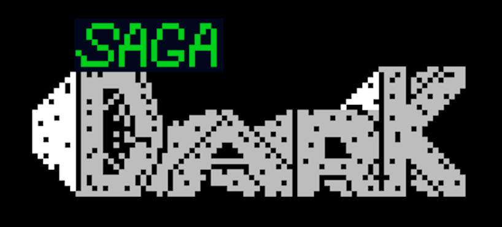

<p align="center">
  
</p>

# Saga Dark

**▶ Play locally:** `tools/play.sh` (starts a local HTTP server and opens the browser at `http://localhost:8000/`). See [Play locally](#play-locally) below.

Action/platform game for ZX Spectrum. **TRITON SOFTWARE © 1989-1990.**

Unfinished back in the day — missing the final level with the boss Kamuir.

**Project goal:** preserve the original source code (recovered from the paper listing) byte-perfect against the
surviving snapshots, and serve as the authoritative base for remakes, ports, and completions of the game on any
platform. Active remakes live under `remakes/`, each with its own README and build pipeline.

**Original team:**

- Alfonso Tribaldo — mapping (levels)
- Antonio Juan Hernandez Cuellar — graphics
- Carlos Perez Ruiz — programming
- Jose Menor — other credits
- Miguel Angel Esteve Marco — programming

**Live, authoritative context:** see [CONTEXT.md](CONTEXT.md).

---

## Current status (2026-05-09)

The 4 original pieces are **source-perfect byte-perfect** against the original snapshots — that is, the editable `.asm`
compiles to a binary identical to the snapshot bit by bit:

| Piece                 | Source                    |          Size | Snapshot                    |
|-----------------------|---------------------------|--------------:|-----------------------------|
| Dark 1 (Phase 1)      | `original-48k/src/dark1/` | 31739/31739 B | `snapshots/dark1/dark1.sna` |
| Dark 2 (Phase 2)      | `original-48k/src/dark2/` | 31739/31739 B | `snapshots/dark2/dark2.sna` |
| Dark 3 (Dragon Phase) | `original-48k/src/dark3/` | 25536/25536 B | `snapshots/dark3/dark3.sna` |
| Film (intro)          | `original-48k/src/film/`  | 41527/41527 B | `game-sagadark.tap`         |

Each `src/<phase>/` folder has a `build.sh` that produces a raw `.bin` + an executable `.sna`, and verifies byte-exact
match. Dark 1 and Dark 2 also accept `cheat` (INFINITE_ENERGY) as a flag.

**Verified in emulator (FuseX, ZEsarUX):** all 4 builds boot and play correctly.

---

## Repository structure

```
saga-dark/
├── original-48k/                ← original ZX Spectrum 48K version (1989-1990)
│   ├── src/
│   │   ├── dark1/               ← Phase 1 — 19 .asm + 4 sprite .bin
│   │   ├── dark2/               ← Phase 2 — main + 9 enemies (shared engine)
│   │   ├── dark3/               ← Dragon Phase (special engine)
│   │   └── film/                ← Saga Film intro / cutscene
│   ├── disasm/                  ← z80dasm disassemblies of the .sna files (authoritative)
│   ├── ocr/                     ← OCR text of the original paper listings
│   ├── scan/                    ← PDFs of the original paper listing
│   ├── snapshots/               ← original .sna + .z80 (dark1, dark2, dark3, film)
│   └── build/                   ← build outputs (gitignored)
├── remakes/                     ← community remakes/ports (released live here)
│   ├── 128k-plus2-film/                ← Film (intro) on +2 128K — bilingual ES/EN ✅
│   ├── 128k-plus2-platformer/          ← Full platformer (Dark 1 + 2 unified) ✅ v1 released
│   ├── 128k-plus2-dragon/              ← Dragon Phase (Dark 3) standalone ✅
│   └── _in_progress/
│       └── 128k-plus2-platformer-v2/   ← v2 WIP — copy of v1, adds Level 5/Kamuir endgame
├── docs/                        ← technical documentation
│   └── jsspeccy/                ← JSSpeccy 3.2 (GPL v3, by Matt Westcott) — web emulator
├── resources/                   ← fonts, playback (reference video)
├── tools/
│   ├── validation/              ← OCR cleanup + byte-exact verification scripts
│   ├── zx_dumper/               ← Python visualiser for memory blocks of a .sna
│   └── zx0/                     ← ZX0 compressor (Saukas v2.2) + 68/69 B Z80 decoders
├── index.html                   ← GitHub Pages landing — loads JSSpeccy + .sna selector
├── CONTEXT.md                   ← live context (always up to date — read first)
└── README.md                    ← this file (summary)
```

> **`spectrumizer`** — the MIDI → ZX Spectrum AY/PT3 music generator — has moved to its
> own repository: <https://github.com/revengator/spectrumizer>.

## How to build and test

```bash
# Build Dark 1
original-48k/src/dark1/build.sh                # bin + sna byte-perfect
original-48k/src/dark1/build.sh cheat          # with INFINITE_ENERGY

# Same for Dark 2 and Dark 3
original-48k/src/dark2/build.sh [normal|cheat]
original-48k/src/dark3/build.sh [normal|cheat]

# Film
original-48k/src/film/build.sh                 # film.bin + film.tap
```

To launch the `.sna`/`.tap` in an emulator, see [docs/emulator.md](docs/emulator.md).

## Play in the browser

The repo ships an `index.html` at its root that embeds [JSSpeccy 3.2](https://github.com/gasman/jsspeccy3) (GPL v3, bundled in `docs/jsspeccy/`) and offers a menu of every committed snapshot — JSSpeccy reads each snapshot's machine model and switches the emulated hardware on load, so 48K originals and +2 128K remakes share one menu:

- **Remakes (+2 128K):** Platformer (Dark 1 + 2, normal **and** infinite-energy cheat), Dragon Phase, Saga Film intro.
- **Originals (48K, 1989-1990):** Dark 1 (normal + infinite-energy cheat), Dark 2 (normal + cheat), Dark 3 (Dragon), Film intro.

When [GitHub Pages](https://pages.github.com/) is enabled for the repo, this page is served directly. To run it from a local checkout instead:

```bash
tools/play.sh                 # default port 8000, opens browser automatically
tools/play.sh 9000            # custom port

# Equivalent without the helper:
python3 -m http.server 8000   # then visit http://localhost:8000/ manually
```

Markdown files on GitHub can't execute JavaScript (the `<script>` tag is stripped), so the embed itself is not viewable directly from a browsed-on-GitHub `.md` file. The local server is the supported flow.

## Remakes

The original 48K source is preserved in `original-48k/`. Remakes, ports, and platform-specific completions live under
`remakes/` — one folder per target, each self-contained with its own build, assets, and README. Works-in-progress live
in `remakes/_in_progress/`; once finished they move directly under `remakes/` (no marker = ready).

| Remake | Platform | Status |
|---|---|---|
| [`128k-plus2-film`](remakes/128k-plus2-film/README.md) | ZX Spectrum +2 128K | ✅ Ready — bilingual ES/EN intro · ZX0 compression of every static screen + cartela · two-track AY soundtrack (Track A boot→jaca, Track B post-jaca→credits) at full volume |
| [`128k-plus2-platformer`](remakes/128k-plus2-platformer/README.md) | ZX Spectrum +2 128K | ✅ Ready (v1) — Dark 1 + Dark 2 unified into one continuous game (Phase 1 → inter-level screen → Phase 2 → ending). Player turn/flip, per-tick energy + damage flash, tuned bosses, per-level AY music (Phase 1 = original Follin-style *Heroic Theme*, Phase 2 = Holst *Mars*, PD). Both `build/saga-platformer-128k.sna` (normal) and `build/saga-platformer-128k-cheat.sna` (infinite energy) ship runnable. ⏳ Level 5 / Kamuir / Book / ending = future v2. |
| [`128k-plus2-dragon`](remakes/128k-plus2-dragon/README.md) | ZX Spectrum +2 128K | ✅ Ready — Dragon Phase standalone · *In the Hall of the Mountain King* (Grieg, PD) as the main AY soundtrack with proximity-driven dynamic tempo · sad-trombone death sting · victory screen with a dedicated A-major fanfare PT3. |

## Documentation

- [CONTEXT.md](CONTEXT.md) — live context, decisions, status by phase.
- [docs/engine-architecture.md](docs/engine-architecture.md) — the 3 engines (main, Dragon, Film).
- [docs/screen_catalog.md](docs/screen_catalog.md) — visual catalogue of screens.
- [docs/game_flow.md](docs/game_flow.md) — game flow, cutscenes, UI.
- [docs/emulator.md](docs/emulator.md) — emulator install + commands.

## Techniques applied (ongoing)

The +2 128K builds are getting an iterative pass of classic + modern (2018-2026) ZX Spectrum techniques to raise the technical floor before the new Phase 5 / Kamuir content lands. Catalogue and roadmap in [`remakes/_in_progress/128k-plus2-platformer-v2/IDEAS.md`](remakes/_in_progress/128k-plus2-platformer-v2/IDEAS.md); active priority list in [CONTEXT.md §"RESUME HERE"](CONTEXT.md).

| # | Technique | Status |
|---|---|---|
| 1 | ZX0 compression of static screens / cartelas / fonts (Saukas v2.2; 68 B Z80 forward decoder) + on-demand per-pantalla decompression to a single shared `SCREEN_BUF` (B+ pass, 2026-05-07) | ✅ done in [`128k-plus2-film`](remakes/128k-plus2-film) — **~25 KB freed** in active banks 5/2/0 by aliasing the 9 PPANTs + IMGSOL + IMGJACA buffers to one 4609 B `SCREEN_BUF`; image-wide ~68 KB hard-free across the 128 KB. Disolved the PPANT5..9 + IMGSOL visual bug structurally. See [`MEMORY-MAP.md`](remakes/128k-plus2-film/MEMORY-MAP.md) for the address-ordered map (regenerated by `tools/film-memory-map.py --update`). ❌ not viable on dragon (`offscreen-title.bin` doubles as a sprite source during gameplay — see [`128k-plus2-dragon/README.md`](remakes/128k-plus2-dragon/README.md)). ⏳ pending in platformer (Phase 2 stash compression). |
| 2 | AY music via Vortex `.pt3` + IM2-hooked replayer | ✅ done in [`128k-plus2-film`](remakes/128k-plus2-film) — two-track soundtrack split at the jaca-scroll boundary (A = *The Entertainer*, Scott Joplin PD, our spectrumizer arrangement, from the language choice through the desert-arrival scenes; B = *Bushido (Vispera)*, our own original composition, for narrative cartelas + end credits). Player is Sergey Bulba's PT3 r.7 hooked from `master_im2`, at full volume (the `ROUT_A0` right-shift is disabled — the only SFX is the text beeper, a separate channel). ✅ also done in [`128k-plus2-dragon`](remakes/128k-plus2-dragon) — Grieg's *In the Hall of the Mountain King* (PD) as the main soundtrack with dynamic tempo driven by dragon proximity (`D_DRAC`), sad-trombone death sting state machine, and a dedicated A-major fanfare on the victory screen. Both PT3 modules generated from scratch by `tools/pt3-compose-*.py`. ✅ also done in [`128k-plus2-platformer`](remakes/128k-plus2-platformer) — per-level AY music (Phase 1 = original Follin-style *Heroic Theme*, Phase 2 = Holst *Mars* PD), switched at the inter-level transition via `music_play_track`. |
| 3 | Polyphonic beeper SFX (Phaser1 / Octode) | ⏳ planned |
| 4 | Pre-shifted player sprite in platformer | ⏳ planned |
| 5 | NIRVANA+ (multicolour, 2 attrs / 2 lines) on dragon + film cartelas — falls back to Bifröst*2 if too costly | ⏳ planned — the cartelas were drawn for B&W TV readability so the colour-resolution upgrade is the right fix |
| 6 | Bifröst*2 selectively in platformer HUD + per-phase HUD theme | ⏳ planned |
| 7 | Cinematic Phase 1→2 transition + pause + options menu | ⏳ planned |
| 8 | Distribution: `.tap` / `.trd` / `.dsk` / `.nex` + JSSpeccy embed | ⚙️ JSSpeccy embed done (`index.html` + `docs/jsspeccy/`, run locally with `tools/play.sh`); other format wrappers ⏳ planned |

## Credits

- **Original game (1989-1990):** TRITON SOFTWARE — see "Original team" above.
- **Film remake soundtrack (+2 128K):**
  - Track A — *The Entertainer* (Scott Joplin, 1902 — **public domain**), our own sequencing of [Mutopia piece 263](https://www.mutopiaproject.org/cgibin/piece-info.cgi?id=263) arranged with [spectrumizer](https://github.com/revengator/spectrumizer).
  - Track B — *Bushido (Vispera)* (2026), an **original composition** written for this project — a samurai-era eve-of-battle cue generated by `tools/pt3-compose-bushido.py`.
  - Both are public-domain or original works.
- **Dragon remake soundtrack (+2 128K):**
  - Main theme — *In the Hall of the Mountain King* by **Edvard Grieg** (Op. 23 No. 7, 1875), public domain by age (Grieg †1907). Arranged to PT3 by `tools/pt3-compose-mountain-king.py`.
  - Victory theme — original A-major composition referencing the Grieg motif, generated by `tools/pt3-compose-victory.py`.
- **PT3 player:** Vortex Tracker II PT3 player r.7 by **Sergey Bulba** (2004-2007), public domain.
- **Web emulator:** [JSSpeccy 3.2](https://github.com/gasman/jsspeccy3) by **Matt Westcott** (gasman), GPL v3. Bundled unmodified in `docs/jsspeccy/` (its own `COPYING` is kept alongside).

## License

- Project sources & assets released under [Creative Commons BY-NC-SA 4.0](LICENSE).
- Non-commercial use only, with attribution and share-alike.
- Scope: this applies to **original Saga Dark code, graphics, and text only**. Bundled third-party tools keep their own licences — the Bulba PT3 player is public domain, JSSpeccy is GPL v3 (see Credits).
