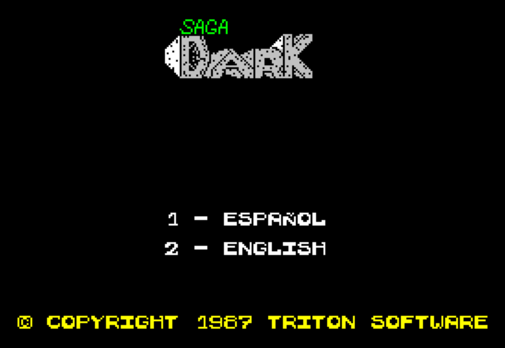

# Saga Dark — +2 128K — Film (intro)

**▶ Play locally:** `tools/play.sh` from the repo root opens the JSSpeccy 3 embed in your browser — press the *Saga Film* button to switch from the default Dragon view. See [the root README](../../README.md#play-locally) for details.

The Film (1987 intro/cinematic by Triton Software) reworked as a standalone
+2 128K minigame, with a bilingual ES/EN menu, ZX0 compression of every
static screen and narrative cartela, a two-track AY soundtrack, and a
divergent source tree that serves as the base for future feature
subversions (NIRVANA+ multicolour cartelas, more language packs, …).

## Status

✅ Ready. Visual behaviour matches the 48K original (which shipped silent —
the AY soundtrack is the only audio divergence and is intentional). All
other intentional divergences from the cassette are listed under
*Improvements*.

## Improvements over the 48K original

- **Bilingual ES / EN.** A two-line menu — `1 - ESPANOL` / `2 - ENGLISH` —
  appears under the SAGA DARK logo. In ES the film runs verbatim; in EN every
  visible string is replaced via a single LDIR overlay, then a couple of
  per-string fixups (see `MEMORY-MAP.md` for the bank-1 stash + `lang_final`
  helper).
- **Length-preserving translations.** Every EN string is the same byte length
  as its ES counterpart, with leading/trailing spaces tuned so the visible
  text appears centered/aligned the same way as the Spanish — the EN bytes
  LDIR over the ES in place.
- **Big-letter prefixes handled per language.** The Spanish version prefixes
  several lines with a giant first letter (`AMPLI_E + 'STAS...'` reads as
  `'ESTAS...'`). In EN, the giant letter is kept where it still helps
  (`AMPLI_E + 'VERYONE...'` → `'EVERYONE...'`) and suppressed where it would
  read as garbage (`AMPLI_Y` before "THE STORY BEGINS", `EX2` before "AND
  HERE THE STORY..."). Suppression is done in `lang_final` by NOPing the
  call site or writing `0xFF` over the tile-string head.
- **Menu wipe after selection.** Once a language is picked the menu is
  blanked from the screen so it does not bleed into the rest of the
  cinematic.
- **No "press any key to continue" before the menu.** The original
  `PAUSE-1` (`CALL 7997`) was removed; the language menu itself already
  acts as the wait-for-key, with the bonus that the prompt is meaningful
  (you must actually choose 1 or 2).
- **ZX0 compression of every static screen and narrative cartela.**
  All nine PPANT screens (ABOYAYO, CIUDAD, BOOM, MUERTO, BICHOS,
  1POBLAD, KAMUIR, 2POBLA, NOOO), both fonts (CHARSET + CHARX2 + the
  special CHARESP), the Jaca image, the sun graphic, and all ten
  narrative cartelas in **both** ES and EN move out of their original
  buffers as ZX0-compressed blobs (Saukas v2.2 — typical ratio ~70%).
  Two techniques: (a) **forward** decompression from bank 6 (paged in
  slot 3 only at boot) for blobs whose destination is in slot 1 or 2
  fixed (PPANT1..4, fonts, IMGJACA, ES cartelas) — frees the original
  buffers for future content; (b) **in-place backwards** decompression
  for blobs in bank 0 (PPANT5..9, IMGSOL) — the ZX0 backwards format
  places the compressed blob at the end of its own destination, no
  bank-paging conflict. EN cartelas + credits live compressed in bank 1
  and are decoded by `LANG_OVERLAY` (with a 68 B local copy of
  `dzx0_standard` to avoid having to page out bank 1 mid-overlay). Net
  result: **about 18 KB freed in game-active banks 5 / 2 / 1**, the
  prime landing zone for the upcoming AY music + NIRVANA+ multicolour
  features. Static integrity verified: post-boot bank 0 and bank 2 are
  byte-identical to the pre-ZX0 baseline. See
  [`ZX0-REPORT.md`](ZX0-REPORT.md) for the full per-blob compression
  table and the technique walkthrough.
- **Two-track AY soundtrack.** The 1987 cassette intro shipped silent
  (no AY, no beeper). The +2 build hooks Sergey Bulba's Vortex Tracker II
  PT3 player r.7 into a custom IM2 dispatcher (`master_im2`) that ticks
  the player every frame and chains into the per-scene animation. Two
  modules split at the existing jaca-scroll silence boundary:
  - **Track A** — *The Entertainer* (Scott Joplin 1902, public domain;
    our sequencing of the Mutopia typeset, arranged with spectrumizer
    `--style chiptune`) — language menu through the desert-arrival
    scenes (lighter / on-the-road). Playback starts the moment a
    language is chosen: `music_paused` boots as 1 and `wipe_menu`
    does the first `music_resume`, so the menu itself is silent.
  - **Track B** — *Bushido (Vispera)* (our own original composition,
    2026) — post-jaca through narrative cartelas + PIJAMA end credits.
    A samurai-era eve-of-battle cue in the miyako-bushi scale on D:
    shakuhachi (scoop-bend + vibrato), koto, taiko heartbeat — a slow
    tension build that never breaks into the battle, closing on a
    suspension that loops seamlessly into its own opening. Generated by
    `tools/pt3-compose-bushido.py`. Loops the whole module.
  - Player + both modules + VARS share bank 3 with ~6.8 KB margin.
  - Music plays at full volume: the `ROUT_A0` volume right-shift (a
    leftover from the platformer) is disabled — the film's only SFX is the
    text-typing beeper, a separate channel, and the /2 crushed the dynamics.
  See [`SOUNDTRACK.md`](SOUNDTRACK.md) for credits, scene breakdown, and
  the technical brief.
- **Divergent fork ready for feature subversions.** Source lives under
  `src/` in this folder.
  This is the base for upcoming subversions: NIRVANA+ multicolour
  cartelas, more language packs, etc. The 48K original is preserved
  intact at `original-48k/`.

## Free space available for new features

After the ZX0 v-final + B+ + AY-soundtrack passes, the 128 KB image still has **~45 KB hard-free** for the upcoming techniques (NIRVANA+ multicolour for the cartelas, more language packs, extra ZX0 blobs, beeper SFX engine, etc.). Distribution:

| Bank | Free | Best fit |
|---|---:|---|
| 1 (overlay) | 14.5 KB | More language packs (LDIR + ZX0 infra already in place) |
| 3 | ~6.8 KB | Tail margin after PT3 player + Track A (5188 B) + Track B (2044 B) |
| 4 | 16 KB | NIRVANA+ multicolour line tables |
| 6 (boot stash) | ~1.9 KB | Small extra ZX0 blobs that decompress at boot |
| 7 | ~4.7 KB | Tail margin after PPANT4/5/9 overflow stash |

Full per-bank breakdown and the live "do-not-touch" zones in [`MEMORY-MAP.md`](MEMORY-MAP.md) (top-of-file table). Numbers are measured directly from `build/saga-film-128k.sna`.

## Subversions

- ✅ **AY soundtrack** — delivered. Two PT3 modules (Track A boot→jaca, Track B post-jaca→credits) play through Bulba's Vortex Tracker II PT3 player r.7, hooked into IM2 from `master_im2`, at full volume (the `ROUT_A0` right-shift is disabled). Scene catalogue, credits, and the historical brief in [`SOUNDTRACK.md`](SOUNDTRACK.md).
- ❌ **NIRVANA+ / Bifröst*2 multicolour cartelas — discarded 2026-05-10.** Conceptual mockup pass on PANT7 (Kamuir) showed the original art is already cromatically resolved within the 8×8 attribute language; the visible color clash is stylistically intentional. Bifröst*2 would only refine cell borders (marginal/regressive when applied as zone-recolour) and NIRVANA+ would require pausing PT3 during cartelas (incompatible IM2). The B&W cartelas (PANT1/PANT10) would also lose their deliberate narrative contrast vs the colour ones.
- ⏳ **More language packs.** The bank-1 LDIR + ZX0 infrastructure already supports adding FR / IT / DE etc. — strings need to be the same byte length as the ES originals (see *Length-preserving translations* above).

## Screenshot — language menu



## Approach

The Film already fits in 48K. On +2 128K it keeps `ORG 0x5DC0` (= 24000 =
`INICIO` in `game.asm`), with the IM2 vector still at `0xFDFD` (`ORG
65021`). The English-strings stash and the language-overlay routine live
in pageable bank 1 (`0xC000` while paged into slot 3); a small bootstrap +
helper routines (`lang_final`, `wipe_menu`) sit in the printer buffer at
`0x5B00` so they remain reachable when bank 1 is paged. Full layout in
[`MEMORY-MAP.md`](MEMORY-MAP.md).

## Verification target

Behaviour-equivalent against the 48K original
(`original-48k/snapshots/film/film.z80`) for the ES path on the
visual side. The EN path and the AY soundtrack are new; both verified
visually / aurally in ZEsarUX.

## Credits

- **Original 48K Film (1987):** TRITON SOFTWARE — see root [`README.md`](../../README.md).
- **Track A** — *The Entertainer* (1902) by **Scott Joplin** (public domain; Joplin died 1917). Our own sequencing: [Mutopia typeset, piece 263](https://www.mutopiaproject.org/cgibin/piece-info.cgi?id=263) (Public Domain), arranged for the AY with [spectrumizer](https://github.com/revengator/spectrumizer) `--style chiptune`.
- **Track B** — *Bushido (Vispera)* (2026), an **original composition** written for this project: a samurai-era eve-of-battle cue (miyako-bushi scale, shakuhachi/koto/taiko voicings). Composed natively for the AY by [`tools/pt3-compose-bushido.py`](../../tools/pt3-compose-bushido.py) on [spectrumizer](https://github.com/revengator/spectrumizer)'s pt3 library.
- **PT3 player r.7** by **Sergey Bulba** (2004-2007) — public domain.

## Build

```bash
./build.sh   # produces build/saga-film-128k.sna
```

The `.sna` is a fixed-size 128K snapshot loadable in any +2 128K emulator
(FuseX, ZEsarUX, etc.).

## Run

```bash
../../tools/run-emulator.sh build/saga-film-128k.sna
```
